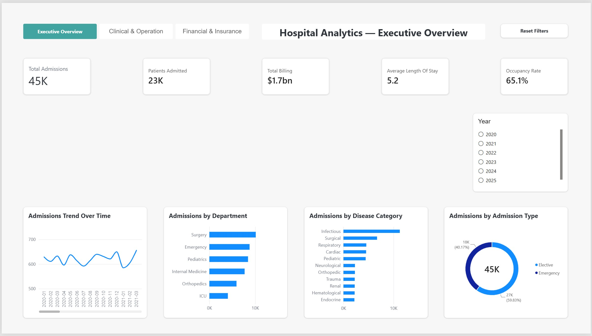
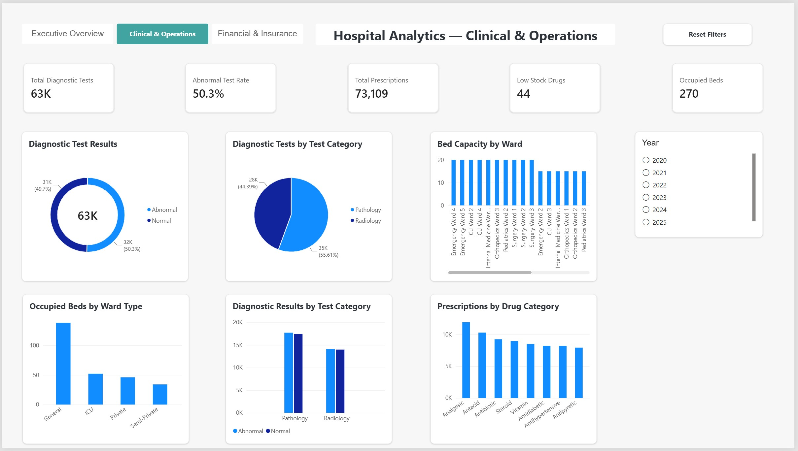
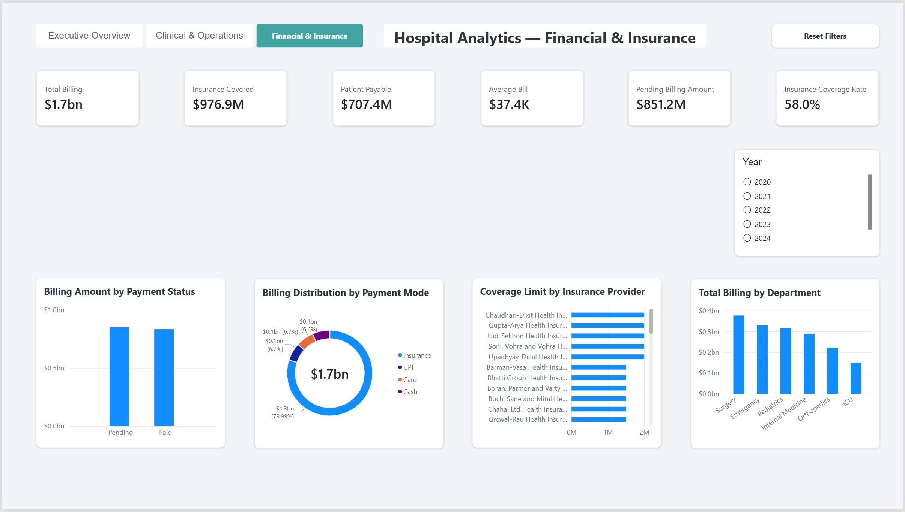

# Hospital Analytics – SQL Server & Power BI

## Project Overview

I built this project to practice a complete hospital data analytics workflow using SQL Server and Power BI.

I started with raw hospital CSV files, created the database and relationships in SQL Server, loaded and validated the data, and then connected the database to Power BI. In Power BI, I cleaned and reviewed the data in Power Query, built the data model, created DAX measures, and developed three interactive dashboard pages.

The dataset includes patients, admissions, departments, wards, beds, employees, doctors, diagnostic tests, prescriptions, drugs, inventory, billing, insurance, and staff assignments.

---

## Tools Used

- Microsoft SQL Server
- SQL Server Management Studio (SSMS)
- SQL
- Power BI
- Power Query
- DAX
- Python for a few data-cleaning tasks

---

## Database

The `HospitalAnalyst` database contains 19 related tables.

Some of the main areas are:

- Patients and admissions
- Departments, wards, and beds
- Employees and doctors
- Diseases and diagnostic tests
- Drugs, prescriptions, and inventory
- Billing and billing details
- Insurance providers and patient insurance
- Staff assignments

I created the primary and foreign key relationships and checked the relationships again after loading the data.

---

## ETL and Data Import

I loaded the hospital CSV files into SQL Server, mainly using `BULK INSERT`.

During the import process I had to troubleshoot several issues, including:

- Data type mismatches
- Decimal conversion errors
- Blank and NULL values
- File-access errors
- Column-order problems
- Primary key errors
- Foreign key errors
- Parent tables that needed to be loaded before child tables

I documented the main ETL problems and how I fixed them in the `documentation` folder.

---

## Data Quality Checks

Before building the dashboard, I checked the data for common quality problems.

Some of the checks included:

- NULL values
- Duplicate records
- Invalid categories
- Numeric ranges
- Date logic
- Orphan records
- Foreign key validation
- Billing amount reconciliation
- Insurance policy dates
- Inventory status
- Bed counts by ward

I did not automatically change questionable source data when there was not enough information to know the correct value. In those cases, I documented the issue instead.

---

## SQL Analysis and Database Programming

I also added SQL analysis queries, stored procedures, and triggers using the same hospital database.

The SQL work includes joins, aggregations, CTEs, subqueries, window functions, date analysis, validation logic, transactions, TRY/CATCH, and audit triggers using the inserted and deleted tables.

---

## Power Query

After connecting SQL Server to Power BI, I reviewed all 19 tables in Power Query.

I used column profiling to check valid, error, empty, distinct, and unique values.

Some of the transformations included:

- Creating patient age
- Creating age groups
- Creating billing categories
- Cleaning and standardizing phone numbers
- Validating insurance policy dates
- Checking billing totals
- Checking inventory status
- Comparing actual bed counts with ward capacity

Temporary QA columns were removed after the checks were complete.

---

## Data Model

I rebuilt the Power BI relationships manually so I could control the model instead of relying only on automatic relationship detection.

The model includes:

- Fact tables
- Dimension tables
- Bridge/fact-like tables
- One-to-many relationships
- One-to-one relationships where the current data supported them
- Single-direction filtering
- Active and inactive relationships
- A separate Date table

Some database relationships were intentionally left inactive in Power BI because activating them created ambiguous filter paths.

This was an important part of the project because the SQL database relationships and the Power BI semantic model do not always need to behave exactly the same way.

---

## DAX Measures

I created a separate `_Measures` table to keep the measures organized.

Some of the main measures are:

- Total Admissions
- Patients Admitted
- Total Diagnostic Tests
- Total Prescriptions
- Total Billing
- Insurance Covered
- Patient Payable
- Average Bill
- Average Length of Stay
- Total Beds
- Occupied Beds
- Available Beds
- Occupancy Rate
- Low Stock Drugs
- Pending Billing Amount
- Insurance Coverage Rate
- Abnormal Test Rate
- Emergency Admission Rate
- Ward Bed Capacity
- Occupied Beds by Ward Type
- Total Coverage Limit

Some of the DAX functions used in the project include:

`CALCULATE`, `DIVIDE`, `AVERAGEX`, `FILTER`, `COUNTROWS`, `DISTINCTCOUNT`, `SUM`, `AVERAGE`, `DATEDIFF`, and `TREATAS`.

---

# Power BI Dashboard

The final report contains three pages.

## Executive Overview

This page gives a high-level view of hospital activity.

It includes:

- Total Admissions
- Patients Admitted
- Total Billing
- Average Length of Stay
- Occupancy Rate
- Admissions Trend Over Time
- Admissions by Department
- Admissions by Disease Category
- Admissions by Admission Type



---

## Clinical & Operations

This page focuses on diagnostic tests, prescriptions, beds, and hospital operations.

It includes:

- Total Diagnostic Tests
- Abnormal Test Rate
- Total Prescriptions
- Low Stock Drugs
- Occupied Beds
- Diagnostic Test Results
- Diagnostic Tests by Test Category
- Bed Capacity by Ward
- Prescriptions by Drug Category
- Occupied Beds by Ward Type
- Diagnostic Results by Test Category



---

## Financial & Insurance

This page focuses on billing and insurance.

It includes:

- Total Billing
- Insurance Covered
- Patient Payable
- Average Bill
- Pending Billing Amount
- Insurance Coverage Rate
- Billing Amount by Payment Status
- Billing Distribution by Payment Mode
- Coverage Limit by Insurance Provider
- Total Billing by Department



---

## Dashboard Features

The report also includes:

- Synced Year slicers
- Page navigation buttons
- Reset Filters buttons using bookmarks
- Interactive filtering
- DAX measures
- Consistent KPI and chart formatting

One thing I kept in mind when testing the Year slicer was that not every measure should change by year.

For example, the dataset contains the current bed inventory and current bed status, but it does not contain historical bed snapshots. Because of that, measures such as Total Beds can remain the same when the year changes.

---

## Repository Structure

```text
Hospital-Analytics-SQL-PowerBI/
│
├── README.md
│
├── sql/
├── 01_database_schema.sql
├── 02_data_import.sql
├── 03_data_quality_validation.sql
├── 04_analysis.sql
├── 05_stored_procedures.sql
└── 06_triggers.sql
│
├── documentation/
│   └── ETL_Troubleshooting.md
│
└── powerbi/
    ├── README.md
    ├── Hospital_Analytics_Dashboard.pbix
    ├── executive_overview.png
    ├── clinical_operations.png
    └── financial_insurance.png

Project Status
Database design: Completed
Data import: Completed
Data quality validation: Completed
Power Query preparation: Completed
Power BI data model: Completed
DAX measures: Completed
Power BI dashboard: Completed
SQL analysis: Completed
Stored procedures: Completed
Database triggers: Completed


Why I Built This Project

I wanted a project where I could work through the full process instead of only building charts from an already-clean dataset.

The main value for me was working through the problems that came up during data loading, validation, relationship design, DAX, and dashboard development and understanding why each step was needed.
